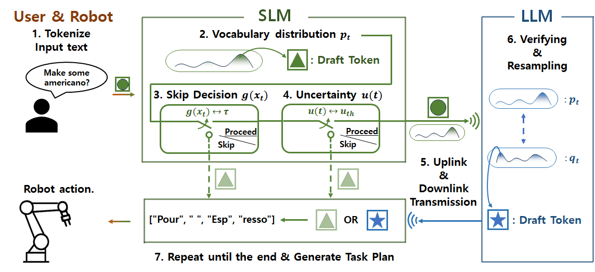
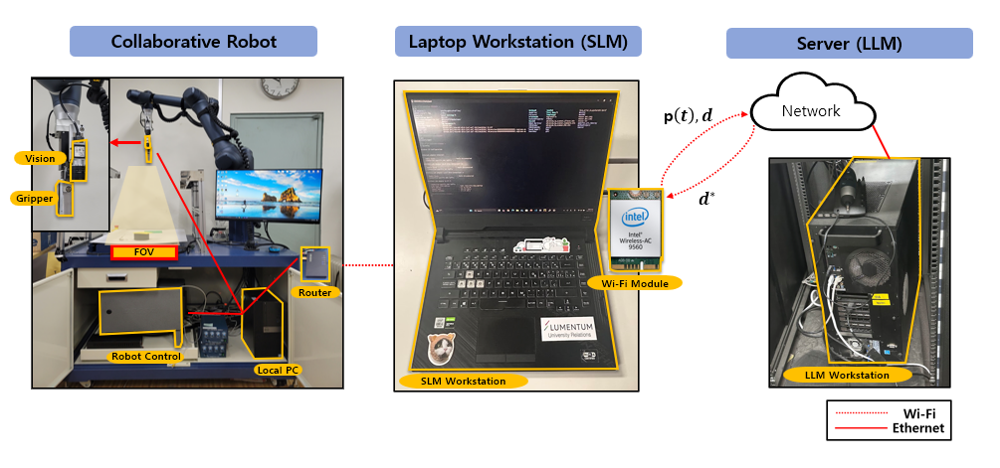
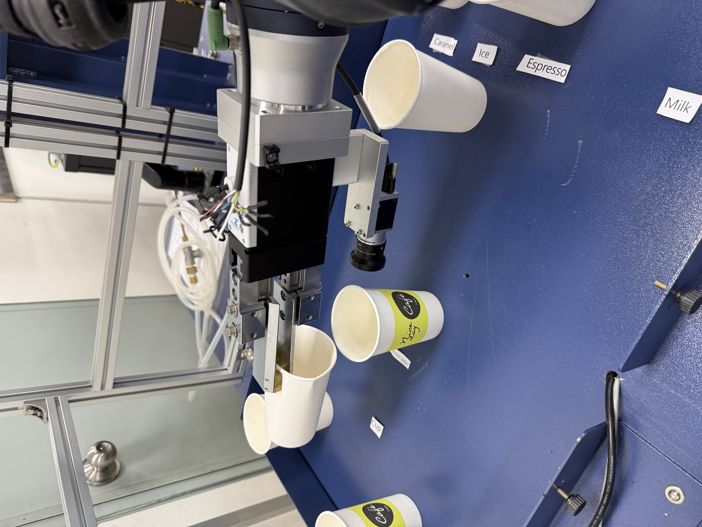
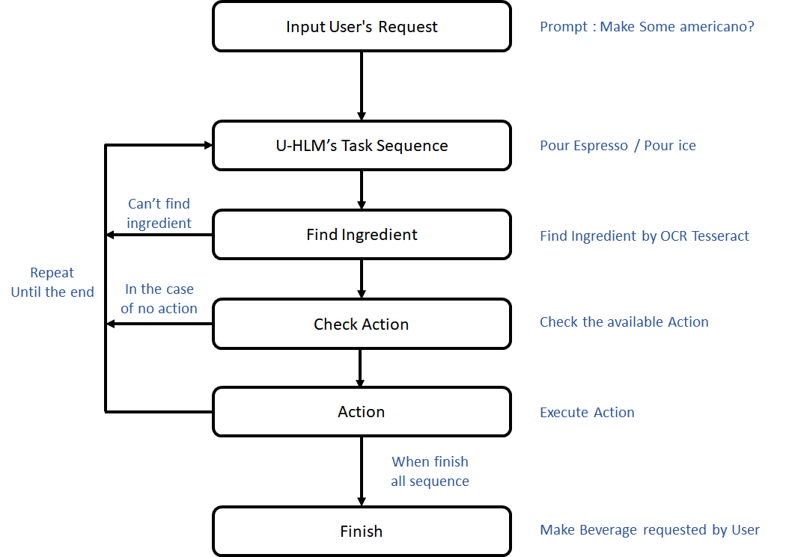
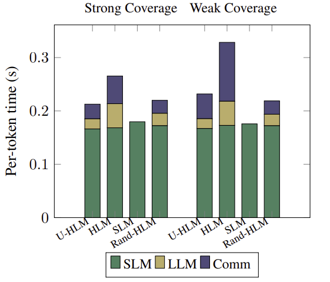
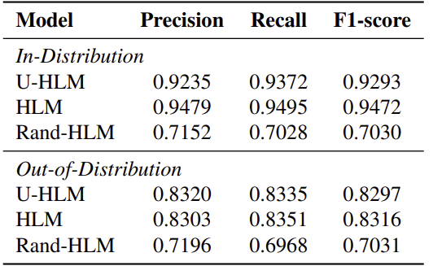
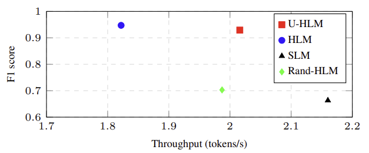
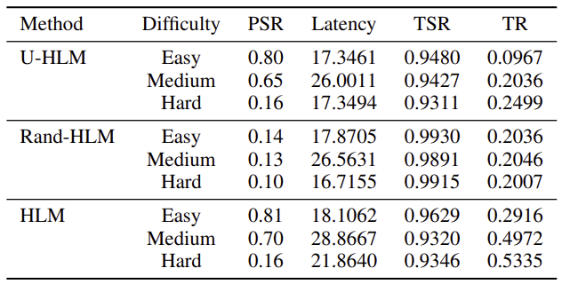

<link rel="preconnect" href="https://fonts.googleapis.com">
<link rel="preconnect" href="https://fonts.gstatic.com" crossorigin>
<link
  href="https://fonts.googleapis.com/css2?family=Roboto:wght@400;700&display=swap"
  rel="stylesheet"
/>

<!-- ② 간단한 CSS를 적용할 수 있는 

<h1 style="text-align: center;">Uncertainty-Aware Opportunistic Hybrid Language Model   in Wireless Robotic Systems</h1>

  Jeyoung Park1, Yeonsub Lim2, Seungeun Oh2,
  Jihong Park3, Jinho Choi4, Seong-Lyun Kim2

  University of Waterloo1, Yonsei University2, Singapore University of Technology and Design3, University of Adelaide4

  <a href="https://github.com/jeyoung78/Robot-Barista"
     style="
       display: inline-block;
       padding: 0.6em 1.2em;
       background-color: #24292e;
       color: #fff;
       border-radius: 9999px;
       text-decoration: none;
       font-weight: bold;
     ">
    💻 Code
  </a>

<h2 style="text-align: center; font-size: 1.5em; margin-top: 2em;">
Abstract
</h2>

  The hybrid language model (HLM) is an emerging architecture that efficiently distributes computation between on-device small language models (SLMs) and remote large language models (LLMs). In HLM, an SLM drafts tokens and its paired LLM validates and refines them, thereby achieving higher token throughput than LLMs and higher inference accuracy than SLMs. Recently, the uncertainty-aware opportunistic HLM has been proposed to improve communication and computation efficiency by skipping LLM verification when the SLM’s uncertainty is low. However, this approach has only been evaluated on simple text prediction tasks under a statistical channel model for theoretical analysis. To validate the practical feasibility of U-HLM, in this paper, we implement U-HLM on a real-world robot testbed, where an industrial-grade robotic manipulator (high-precision robot arm with gripper) runs an SLM and communicates with a remote LLM over Wi-Fi. In this experimental setup, we observe that computing uncertainty itself incurs non-negligible latency. To mitigate this, we propose a conditional uncertainty calculation omission method, which skips the uncertainty calculation when a lightweight logistic regression model predicts the uncertainty to be sufficiently low. Experimental results show that, compared to HLM, the proposed U-HLM improves token throughput by 24.9% and 41.8% under strong and weak Wi-Fi coverage conditions, respectively, while maintaining a 98.11% F1 score.   

<h2 style="text-align: center; font-size: 1.5em; margin-top: 2em;">
Testbed Implementation for U-HLM
</h2>

The Uncertainty-Aware Opportunistic Hybrid Language Model (U-HLM) has been proposed as a practical framework that not only reduces the computational overhead of LLMs by leveraging both an on-device small language model (SLM) and a remote LLM, but also improves token throughput—by enhancing overall communication and computation efficiency.
  
U-HLM leverages uncertainty—the model’s self-assessed confidence in its outputs—to decide whether uplink communication is necessary, enabling the system to skip transmitting the full vocabulary distribution and avoid remote LLM computation for verification and resampling when uncertainty is low.
  
These characteristics make U-HLM a feasible way to improve latency and reduce computational load in LLM-integrated robotic systems.

In this proof-of-concept study to verify U-HLM’s effectiveness on an actual wireless network and as a robotic task planner, we implement a testbed consisting of the following three main components: a laptop (local device), a remote server, a the robot, connected over a wireless network, as shown in Figure. U-HLM deployed on the testbed serves as a task planner, generating sequences of action-object pairs corresponding to given natural language orders to be performed by the robot.

    Experimental Setup

+ 

Local SLM : Tiny-Llama 1.1B on a laptop (6-core Intel Core i7-10750H CPU, 8 GB of DDR4 RAM, and an NVIDIA GeForce GTX 1650 Ti GPU connected to IEEE 802.11ac Wi-Fi on a 5 GHz band)
+ 

LLM : Llama 27B on a Linux server (8-core Intel Xeon Silver 4215R CPU, 64 GB of DDR4 RAM, and three NVIDIA GeForce RTX 3090 GPUs, connected to Ethernet)
+ 

Robot : Doosan A0912s with robot arm (GEP2016IO-00-A gripper), connected same Wi-Fi with a laptop. 

  <!-- 왼쪽 블록 -->
  

    
    

      Experimental Workspace
    

  

  <!-- 오른쪽 블록 -->
  

    
    

Robot Pouring ingredient To Cup
    

  

<h3 style="text-align: center; font-size: 1.5em; margin-top: 1em;">
Robot Work
</h3>

  
    

Success/Fail case

  <iframe
    width="800" height="450"
    src="https://www.youtube.com/embed/QDpbhphWOZo"
    frameborder="0"
    allowfullscreen
    style="max-width:100%;"
  ></iframe>

Success case - Pour   

  <iframe
    width="800" height="450"
    src="https://www.youtube.com/embed/G0jwl1BaSDI"
    frameborder="0"
    allowfullscreen
    style="max-width:100%;"
  ></iframe>

Fail case - When we don't have ingredient   

  <iframe
    width="800" height="450"
    src="https://www.youtube.com/embed/QBKoYIm9qIA"
    frameborder="0"
    allowfullscreen
    style="max-width:100%;"
  ></iframe>

Fail case - No action in robot   

<h4 style="text-align: center; font-size: 1.5em; margin-top: 1em;">
  Experiment with Robot
</h4>

  <iframe
    width="800" height="450"
    src="https://www.youtube.com/embed/Yp4QAQ76CIc"
    frameborder="0"
    allowfullscreen
    style="max-width:100%;"
  ></iframe>

Robot Task Full Video (x6 speed)

     
  Experiment Result

  <!-- 왼쪽 블록 -->
  

    
    

      Per-token latency breakdown for four methods 
        under the strong coverage and the weak coverage
    

  

  <!-- 오른쪽 블록 -->
  

    
    

Model Accuracy (Precision, Recall, F1)
    

  

+ 

Latency
  

    &nbsp;&nbsp;&nbsp;&nbsp;- U-HLM’s per-token latency is about 20 % faster than HLM’s and nearly identical to Rand-HLM’s. (Strong coverage) 
    &nbsp;&nbsp;&nbsp;&nbsp;- U-HLM maintains per token — 29 % faster than HLM’s and still comparable to Rand-HLM’s. (Weak coverage) 
    &nbsp;&nbsp;&nbsp;&nbsp;- HLM’s latency increases by 23.7%, U-HLM’s by 8.9%, while Rand-HLM’s remains essentially unchanged. (Strong to Weak)
  

+ 

Accuracy
  

    &nbsp;&nbsp;&nbsp;&nbsp;- U-HLM achieves a high F1 that is just under HLM’s performance and notably higher than Rand-HLM’s. (In-distribution tasks) 
    &nbsp;&nbsp;&nbsp;&nbsp;- U-HLM’s F1 is very close to HLM’s and still considerably above Rand-HLM’s. (Out-of-distribution tasks)  
  

  <!-- 왼쪽 블록 -->
  

    
    

F1 vs. Token Throughput
    

  

  <!-- 오른쪽 블록 -->
  

    
    

Comparison of U-HLM, SLM, Rand-HLM and HLM  
on Planning Success Rate, Inference latency, 
True Skip Rate and Transmission Rate
    

  

+ 

Uplink Traffic & Latency Savings
  

    &nbsp;&nbsp;&nbsp;&nbsp;- U-HLM cuts the transmission rate by 66% and reduces inference latency. (Easy tasks) 
    &nbsp;&nbsp;&nbsp;&nbsp;- U-HLM halves the transmission rate and speeds up planning by ~10%, lowering latency. (Medium tasks) 
    &nbsp;&nbsp;&nbsp;&nbsp;- U-HLM reduces the transmission rate and cuts latency. (Hard tasks)
  

  + 

Accuracy Impact

    &nbsp;&nbsp;&nbsp;&nbsp;- On medium tasks, planning success drops slightly, while performance on easy and hard tasks remains unchanged. 
    &nbsp;&nbsp;&nbsp;&nbsp;- In contrast, Rand-HLM’s success rate stays below 0.15 across all difficulties. 
  

